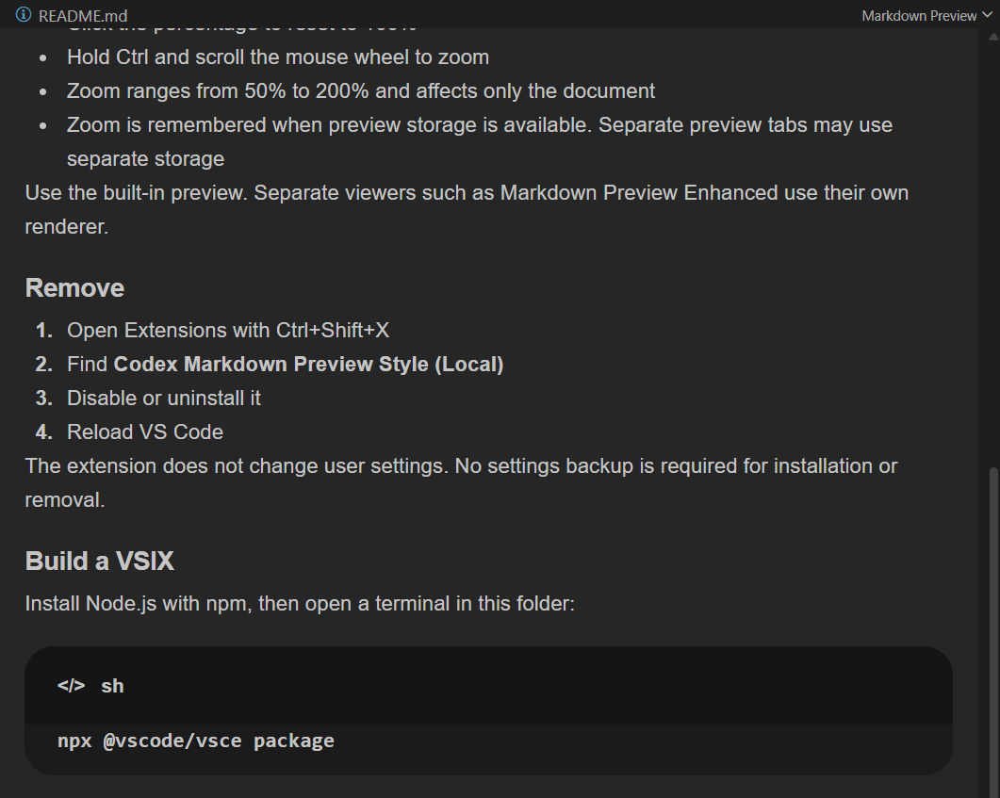

# Codex Markdown Preview Style

A clean, compact style for VS Code's built-in Markdown preview.

## Features

- Compact typography and spacing
- Light, dark, and high-contrast light support
- Rounded code blocks with language labels
- Built-in copy action
- Zoom controls from 50% to 200%
- No settings changes, telemetry, or network requests

## Install

Install **Codex Markdown Preview Style** from the VS Code Marketplace, then reload VS Code.

## Use

Open a Markdown file and press `Ctrl+Shift+V` (`Cmd+Shift+V` on macOS).

The extension styles VS Code's built-in preview automatically. Other Markdown preview styling extensions may override it.
